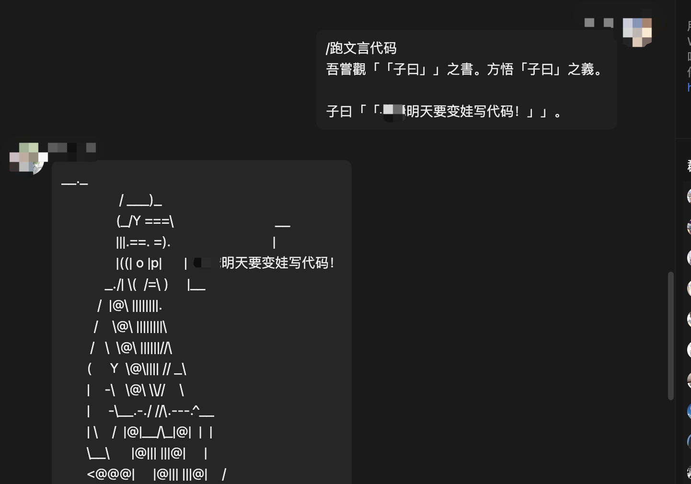

# 文言文编程后端编译服务
用于编译文言文编程语言的后端服务

**基于Node.js Express库**

English Version: [README.md](./README.md)

## 什么是文言文编程语言？
去官方仓库看看就懂了: [Wenyan-lang 文言文編程语言](https://github.com/wenyan-lang/wenyan)

## 使用

### 拉取代码
~~~shell
git clone https://github.com/Vincent-the-gamer/Wenyan-Backend-Server.git
~~~

### 安装依赖
~~~shell
# 没有yarn就用npm
yarn install
~~~

### 运行代码
~~~shell
# 没有yarn就用npm
yarn start
~~~

代码默认运行在: `http://localhost:8080`。

你可以在 `main.js` 中修改IP和端口。

~~~js
const host = "0.0.0.0"
const port = 8080
~~~

### 调用API
* URL: `http://localhost:8080/runCode`
* Method: `post`
* 请求体(Request Body): 
    ~~~json
    {
        "code": "吾有一數。曰三。名之曰「甲」。為是「甲」遍。吾有一言。曰「「問天地好在。」」。書之。云云。"
    }
    ~~~
然后你能得到响应内容:
~~~
問天地好在。
問天地好在。
問天地好在。
~~~
注意：响应是纯文本，如果你是用`axios`调用这个API，直接用`res.data`来获取你的结果。
~~~js
axios.post("http://localhost:8080/runCode",{
    code: "吾有一數。曰三。名之曰「甲」。為是「甲」遍。吾有一言。曰「「問天地好在。」」。書之。云云。"
}).then(
    res => {
        console.log(res.data)
    }
)
~~~

#### 现已支持“文渊阁”包管理器
现在你可以使用文渊阁来扩展代码的功能

**举个栗子🌰:**

* 安装
~~~shell
# 安装子曰库
# Windows
sh wyg.sh i ziyue

# macOS/Linux
./wyg.sh i ziyue
~~~

* 使用
~~~wy
吾嘗觀「「子曰」」之書。方悟「子曰」之義。

子曰「「xxx明天要变娃写代码！」」。 
~~~

被QQ整变形了...

原来长这样：

~~~
                __._                                    
                / ___)_                                  
               (_/Y ===\                            __  
               |||.==. =).                            |  
               |((| o |p|      |  xx明天要变娃写代码！
            _./| \(  /=\ )     |__                     
          /  |@\ ||||||||.                              
         /    \@\ ||||||||\                           
        /   \  \@\ ||||||//\                         
       (     Y  \@\|||| // _\                         
       |    -\   \@\ \\//    \                     
       |     -\__.-./ //\.---.^__                      
       | \    /  |@|__/\_|@|  |  |                     
       \__\      |@||| |||@|     |                     
       <@@@|     |@||| |||@|    /                        
      / ---|     /@||| |||@|   /                         
     |    /|    /@/ || |||@|  /|                         
     |   //|   /@/  ||_|||@| / |                         
     |  // \ ||@|   /|=|||@| | |                        
     \ //   \||@|  / |/|||@| \ |                      
     |//     ||@| /  ,/|||@|   |                         
     //      ||@|/  /|/||/@/   |                         
    //|   ,  ||//  /\|/\/@/  / /                       
   //\   /   \|/  /H\|/H\/  /_/                      
  // |\_/     |__/|H\|/H|\_/                          
 |/  |\        /  |H===H| |                             
     ||\      /|  |H|||H| |                             
     ||______/ |  |H|||H| |                              
      \_/ _/  _/  |L|||J| \_                           
      _/  ___/   ___\__/___ '-._                        
     /__________/===\__/===\---'  
~~~

来这里探索更多文渊阁的奥秘吧：[https://github.com/wenyan-lang/wyg](https://github.com/wenyan-lang/wyg)

## 部署
这个项目是直接可以部署的，这意味着你只需要两步即可部署。
1. 把这个项目从本地拷贝到服务器，或者直接在服务器上使用`git clone`命令拉取。
2. 在项目目录下，运行以下命令(服务器需要Node.js环境)：
    ~~~shell
    # 如果服务器有yarn环境，你也可以使用yarn, 如果要使用yarn，将以下命令的"npm"替换为"yarn"就好
    npm install
    npm start
    ~~~